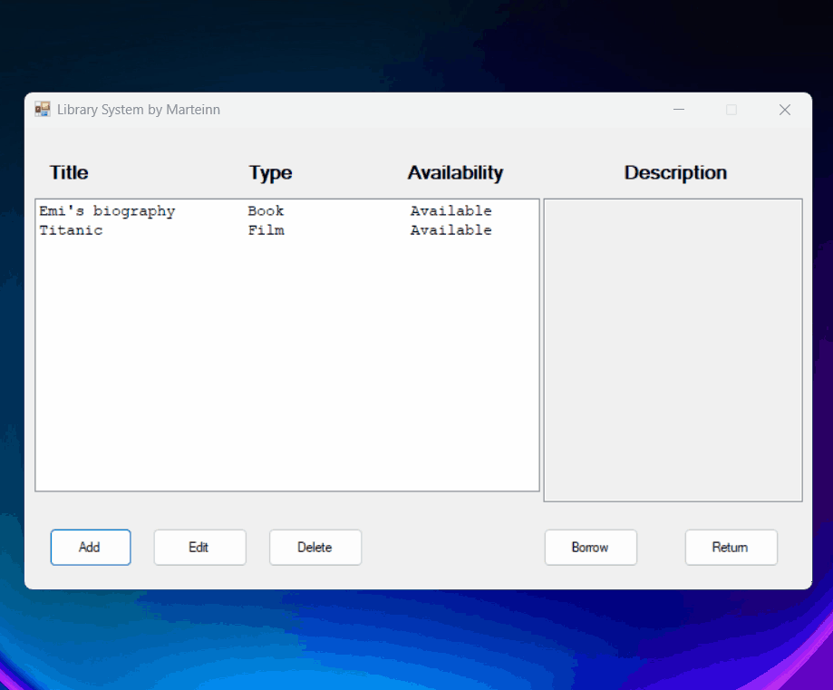

# DEMO

# Overview

The premise of this applicaiton was to practice my C# skills, mainly in terms of object orientation, seperation of classes and design. This project was part of a C# programming course I took during my bachelors, and it was the last assignment work given as an optional assignment for a higher grade. I found the assignment intruiging particularly because the premise was to give total freedom to us students to design and implement whatever we wanted that would showcase and put into use, everything we had learned during the semester.

# Windows Form - Library System

With this in mind, I designed and implemneted a simple library system using the .NET framework and the entity framework (EF) for object relational mapping of the data objects.